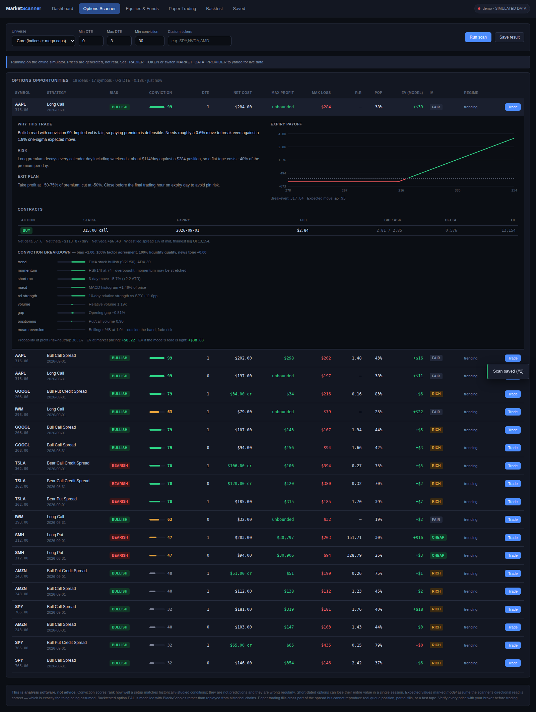
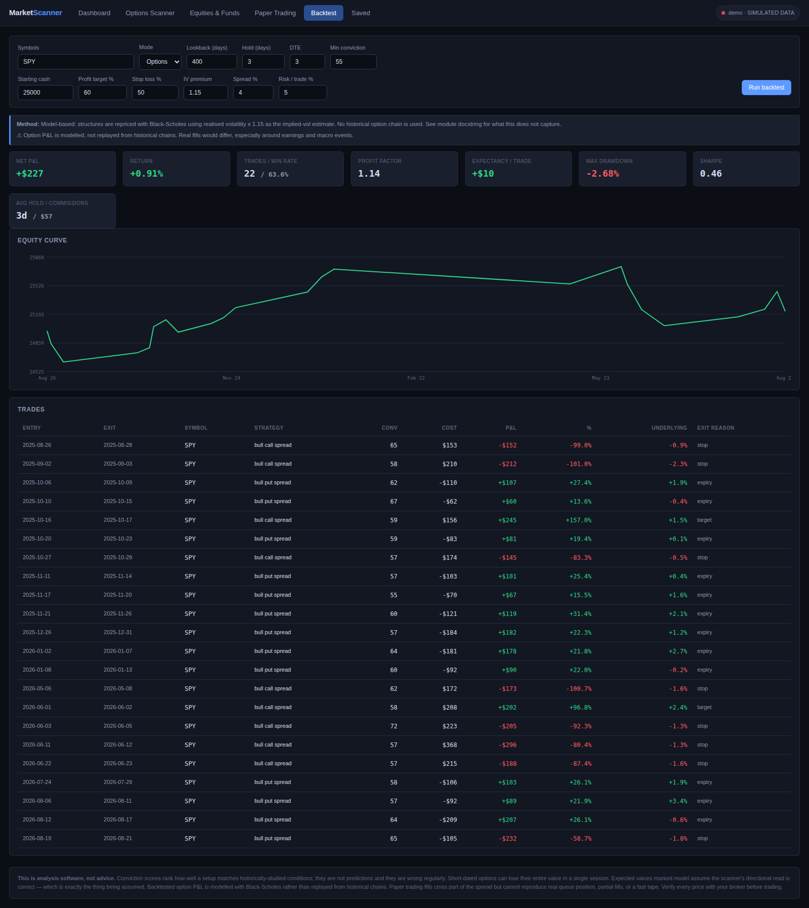
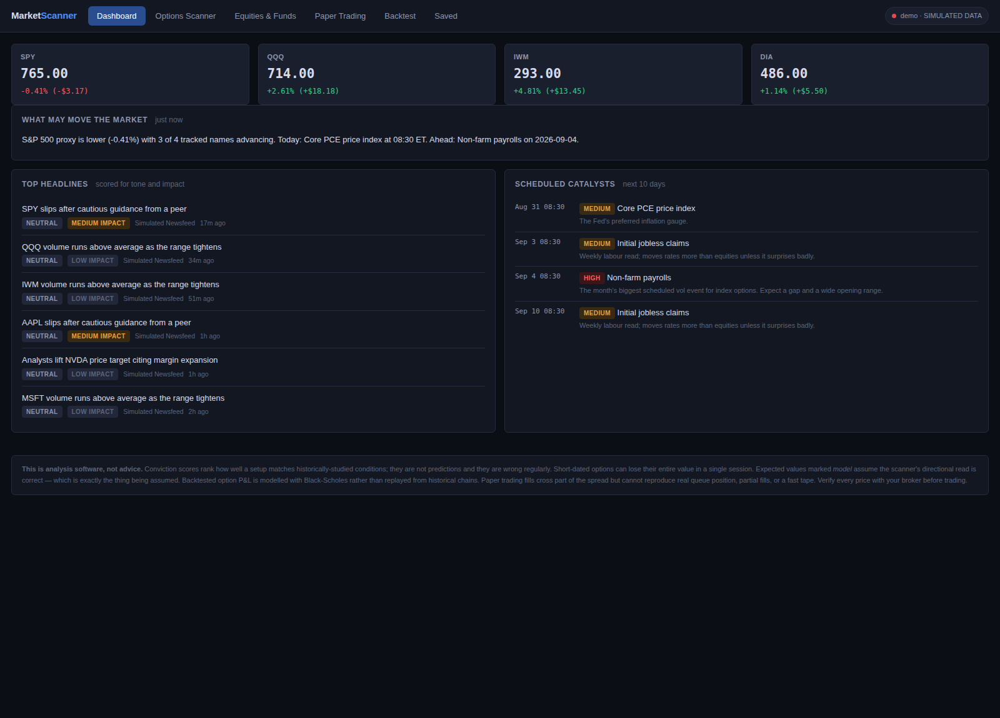
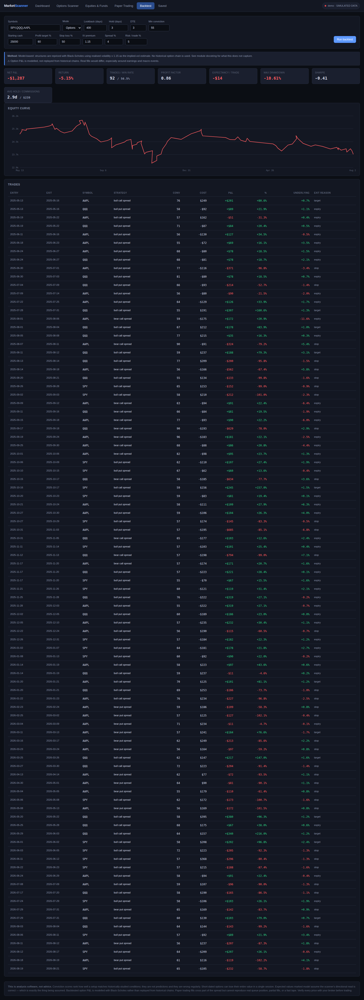

# Market Scanner

A short-horizon options and equity scanner with paper trading and backtesting.
It scans a universe of liquid names, scores each one for directional conviction,
builds concrete option structures from the live chain, and lets you trade them
in a persistent paper account or test the rules over history.

Built for the 0–3 day horizon: same-day and few-day expiries, where liquidity
and time decay matter as much as direction.

## Quick start — no terminal needed

**1. Get the code onto your computer.**
On the repository page on GitHub, click the green **Code** button → **Download ZIP**.
Then **unzip it** (right-click → Extract All on Windows, double-click on Mac).
Open the unzipped folder.

> Make sure you actually extract the ZIP. Double-clicking a launcher *inside*
> a zipped folder will not work on Windows.

**2. Double-click the launcher for your computer:**

| Your computer | Double-click this file |
|---|---|
| **Windows** | `Start Market Scanner.bat` |
| **Mac** | `Start Market Scanner.command` |
| **Linux** | `Start Market Scanner.command` (or run `./run.sh`) |

That's it. A black window opens and does everything for you — builds the
environment, installs what it needs, starts the app and opens your browser.

> **Mac, first time only.** Unzipping strips the "this is a program" flag, so
> macOS may open the file in TextEdit or refuse to run it. Two one-time fixes:
> right-click the file → **Open** → **Open** (this clears the "unidentified
> developer" warning), and if it still opens as text, open **Terminal**, type
> `chmod +x ` (with the trailing space), drag the `Start Market Scanner.command`
> file into the Terminal window, and press Enter. Double-click works from then on.
> Cloning with `git` instead of downloading the ZIP avoids this entirely.

The first run takes a minute or two while it downloads dependencies. Every run
after that takes about two seconds. When it's ready you'll see:

```
  ----------------------------------------------------------
   Market Scanner is running:   http://127.0.0.1:8000
  ----------------------------------------------------------
```

**To stop the app**, close that black window (or press Ctrl+C in it).

### If Python isn't installed

The launcher checks for you and says so. Install Python 3.10 or newer from
<https://www.python.org/downloads/>, then double-click the launcher again.

> **Windows users:** on the first screen of the Python installer, tick
> **"Add python.exe to PATH"** before clicking Install. This is the single most
> common reason the launcher can't find Python afterwards.

### The app runs but shows "no data"

Double-click **`Diagnose Data Sources`** (`.bat` on Windows, `.command` on Mac).
It makes one real request to every source and prints what each returned — the
HTTP status and a plain-language reading of it, so you can tell a rate limit
from a firewall from a DNS problem.

The same check is in the app: when data is missing, the notice at the top of the
Dashboard has a **Check data sources** button.

Common results:

| What the check says | What it means |
|---|---|
| `429 rate limited` | Yahoo throttles unauthenticated use. Wait a few minutes; a Tradier token avoids it entirely. |
| `403 forbidden` | The source is refusing your IP or user agent. The other sources should still work. |
| `blocked (HTML returned)` | A consent screen or captcha instead of data — common on some networks and regions. |
| `DNS failed` / `timed out` | A network problem on your machine: no internet, a VPN, or a firewall. |
| Everything fails | Not a provider problem. Check the connection first. |

If only Yahoo fails, the app keeps working from CBOE and Stooq — you lose
extended-hours quotes but keep option chains and price history.

### Troubleshooting

| What you see | What to do |
|---|---|
| A window flashes open and vanishes instantly | You're probably running it from inside the ZIP. Extract the folder first, then double-click. |
| "Python is not installed (or is too old)" | Install Python 3.10+ from the link above; on Windows tick "Add python.exe to PATH". |
| Mac: *"cannot be opened because it is from an unidentified developer"* | Right-click `Start Market Scanner.command` → **Open** → **Open**. You only need to do this once. |
| Mac: the file opens in a text editor instead of running | Open Terminal in the folder and run `chmod +x "Start Market Scanner.command"` once. |
| "Could not install the dependencies" | Usually no internet, or a work firewall/proxy blocking `pypi.org`. Try another network. |
| `ZoneInfoNotFoundError: 'No time zone found with key America/New_York'` | An old environment built before `tzdata` was added. Delete the `.venv` folder next to the launcher and run it again. |
| The browser doesn't open on its own | Copy the `http://127.0.0.1:8000` address from the window into your browser. |
| Port 8000 was busy | The launcher picks the next free port automatically and prints it — use that address. |

Prefer a terminal? `./run.sh` (Mac/Linux) or `python launcher.py` (anywhere)
does the same thing. For more detail while troubleshooting, set
`MARKET_SCANNER_VERBOSE=1` to see the full server log.

### Getting live data

The app needs a live data provider. With no configuration it uses Yahoo
Finance, which needs no API key. Copy `.env.example` to `.env` to change it:

| Source | Key needed | Equity quotes | Extended hours | Option chains | History |
|---|---|---|---|---|---|
| **Tradier** *(best)* | free token | real-time¹ | yes | real-time¹ | yes |
| **Yahoo** | none | near-real-time | yes | ~15 min delayed | yes |
| **CBOE** | none | delayed | no | ~15 min delayed | no |
| **Stooq** | none | last close | no | no | yes |

¹ A Tradier *sandbox* token returns delayed data. Real-time requires a
brokerage account token. The app reports which it is in the status chip and
never claims data is live when it isn't.

**By default the app uses all of them**, in that order, and takes the first
usable answer for each request. Yahoo is a scraped endpoint that rate-limits
and blocks; CBOE and Stooq need no key, no cookie and no crumb, so a Yahoo
block degrades coverage instead of emptying the screen. Set
`MARKET_DATA_PROVIDER` to a single name, or a comma-separated list, to control
the order yourself.

There is no offline or demo provider. See **Where the numbers come from** below.

```bash
# .env
MARKET_DATA_PROVIDER=tradier
TRADIER_TOKEN=your_token_here
```

Get a free Tradier developer token at <https://developer.tradier.com/>.

With Yahoo, the app re-solves implied volatility from the live bid/ask midpoint
rather than trusting Yahoo's own IV field, which is frequently stale, and
computes greeks itself.

---

## What it does

**Options scanner.** For each symbol it measures trend, momentum, volatility
regime, participation and options positioning, scores a directional bias, then
constructs the structures that fit that read — long calls/puts, debit verticals,
credit verticals, iron condors, strangles. Each idea comes priced against the
actual bid/ask with max profit, max loss, breakevens, probability of profit,
expected value, and a written rationale, risk note and exit plan.


*Every idea expands into its rationale, risk note, exit plan, payoff diagram, contract table and the full factor breakdown behind its score.*

**Conviction scores you can audit.** Every score decomposes into nine weighted
factors, each with a sentence explaining what it saw ("RSI(14) at 74 —
overbought, momentum may be stretched"). Bias and conviction are separate
quantities: a mild read that every factor agrees on scores higher than a strong
read half the factors contradict. Both are gated on whether the option chain is
actually tradeable, because a perfect signal on a 40%-wide market is not a trade.

**Market context.** Headlines scored for tone and impact with an auditable
finance lexicon, plus a scheduled-catalyst calendar (CPI, FOMC, payrolls, PCE,
jobless claims, OPEX) computed from each release's publication rule, and a
plain-language read of what is driving the tape.

**Equities and funds.** Separately ranked for swing holds, scored on trend
persistence and risk-adjusted return, with ATR-based entry, stop and target.

**Paper trading.** Sessions start with whatever cash you choose. Fills cross
part of the bid/ask spread, marks use the exit side of the book, short options
consume buying power, and expiries settle to intrinsic value. Every order, fill
and mark is saved to SQLite so you can reopen a session weeks later and see
exactly what you did.

**Backtesting.** Replays the same scoring rules over history with strict
no-lookahead, sizing off running equity so a losing run cannot compound past
a total loss.


*A paper session started with $100,000: live marks, equity curve, open positions, closed-trade statistics and the full order history.*


*Market overview during the after-hours session: each tile shows the regular close with the day's change, and the post-market price with its move from that close underneath. STALE badges appear when a provider could not be refreshed — those are the last real prices fetched, never generated ones.*

---

## Where the numbers come from

**Every price shown is a price that actually traded.** The app has no simulator
and no demo mode; there is no configuration that will put a generated number in
front of you. `MARKET_DATA_PROVIDER=demo` is rejected at startup with an error.

When a provider cannot be reached, the app shows **the most recent real data it
already fetched**, marked `STALE` with its age, rather than inventing a price or
showing a blank screen. If a symbol has never been fetched successfully it is
listed as having no data — again, never filled in with a guess.

This matters beyond the prices themselves. A simulated feed once generated an
expiration for every weekday, which produced a Tuesday 1 September expiry for
AAPL — a contract that does not exist. Expiration dates now come only from the
vendor's own list, and asking for a date the vendor does not list returns
nothing instead of a chain quietly labelled with the wrong expiry.

### Extended hours

Many exchanges trade outside 09:30–16:00 ET, so the app tracks the session and
keeps the two prices apart:

* `last` is always the **regular-session** price — the last trade during normal
  hours, or the official close once the session has ended.
* `extended_last` is the **pre- or post-market** print, with its own timestamp.

A 4:30pm trade is therefore never presented as the closing price. The dashboard
shows the regular close with the day's change, and the after-hours price with
its move *from that close* underneath — the way a broker displays it. Positions
are marked against the most recent trade in either session.

Sessions (Eastern): pre-market 04:00–09:30, regular 09:30–16:00, after-hours
16:00–20:00. Holidays and 13:00 early closes are computed from the NYSE rules,
so the calendar stays correct without maintenance.

Provider support: Yahoo exposes explicit `preMarketPrice` / `postMarketPrice`
fields. Tradier reports a single last-trade price that silently includes
extended prints, so the app splits it using the session clock and the `close` /
`prevclose` reference prices the payload carries.

---

## How the conviction model works

Nine factors each produce a score in −1…+1 with a fixed weight:

| Factor | Weight | What it measures |
|---|---|---|
| `trend` | 1.30 | EMA 9/21/50 alignment, gated by ADX so chop doesn't read as trend |
| `momentum` | 1.10 | RSI(14) distance from 50 |
| `short_roc` | 0.95 | 3-day move normalised by the stock's own ATR |
| `mean_reversion` | 0.85 | Bollinger %B outside the band, damped when a trend is present |
| `macd` | 0.75 | MACD histogram as a percentage of price |
| `rel_strength` | 0.70 | 10-day excess return vs SPY |
| `volume` | 0.55 | Relative volume, signed by the direction of the move |
| `gap` | 0.50 | Opening gap in ATR units |
| `positioning` | 0.35 | Put/call volume ratio, read contrarian |

**Bias** is the weighted mean. **Agreement** is the share of engaged weight
pointing the same way. **Quality** is a 0–1 liquidity gate from option spread
width, near-the-money open interest and dollar volume. Conviction combines all
of it:

```
conviction = |bias| × (0.45 + 0.55 × agreement) × (0.75 + 0.25 × cleanliness) × quality × 100
```

where cleanliness is the R² of a 10-bar regression — the difference between a
clean trend and a choppy drift with the same net displacement.

Weights live in one dictionary in `backend/engine/conviction.py` so the model
can be retuned without hunting through scoring code.

### Which structure gets chosen

Direction picks the side, the implied-vol regime picks debit vs credit, and
conviction decides how much of the move the structure needs to pay:

| Read | IV cheap/fair | IV rich |
|---|---|---|
| Bullish, high conviction | Long call, bull call spread | Bull put credit spread |
| Bearish, high conviction | Long put, bear put spread | Bear call credit spread |
| Neutral, range regime | — | Iron condor |
| Neutral, vol compressed | Long strangle | — |

### The two expected values

Each idea reports both, and the difference is the point:

- **`ev_risk_neutral`** — EV under the market's own pricing. Approximately zero
  for a fairly-priced structure. If it is strongly negative, the market is
  charging a lot for that exposure regardless of whether your call is right.
- **`ev_model`** — EV under a distribution tilted by the scanner's bias, capped
  at ±60%/yr drift. This is the app's edge claim, and it is only as good as the
  bias. Read it as "what this pays *if the model is right*", not as a forecast.

The risk-neutral calculation is calibrated: a fairly-priced structure computes
to within $0.05 of zero on a $300 position, which is grid discretisation. That
calibration is asserted in the test suite, because if it drifts, every expected
value the scanner reports is silently biased.

---

## Paper trading

Sessions are independent accounts. Start one with any cash amount; run several
side by side to compare approaches.

What is modelled honestly:

- **Fills cross the spread.** Buying lifts toward the offer, selling hits toward
  the bid (35% of the spread by default). Buy and immediately sell and you lose
  money — as you would.
- **Marks use the exit side.** A long is marked at the bid, so a new position
  shows underwater by exactly the spread you paid.
- **Short options consume buying power.** A vertical reserves the strike width;
  an uncovered short reserves a Reg-T approximation. Debit and credit spreads
  are distinguished correctly, so a bull call spread reserves nothing while a
  bull put spread reserves the width.
- **Expiries settle to intrinsic value.** Contracts don't silently vanish at
  expiry — they pay out or expire worthless, and either way it lands in the
  order history with the underlying price at settlement.

What is not modelled: queue position, partial fills, assignment before expiry,
and the way spreads widen in a fast tape. Real fills will be worse than these.

---

## Backtesting

**Equity mode is exact** — real historical bars, fills at the next open plus
slippage.

**Options mode is model-based, and it has to be.** Historical option chains are
a paid dataset that no free provider offers, so the engine reprices each
structure with Black-Scholes using the underlying's trailing realised volatility
times a configurable premium (default 1.15, reflecting the variance risk
premium — so options are *more* expensive to buy in the test, not less).

It does not model the volatility smile across strikes, IV crush around
earnings, spread widening in a fast tape, or assignment and pin risk. It is
deliberately conservative elsewhere to compensate: signals use only bars
strictly before entry, entries fill at the *next* bar's open, and every trade
pays commission and half-spread slippage both ways.

Treat the output as a sanity check on whether a rule has any edge at all, not
as a forecast of returns. The UI states the method above every result.

The test suite runs the backtester over a random-walk price series with no
predictable structure. The strategies lose money there, roughly by the
transaction costs — which is what an unbiased backtester should show, and
evidence that no lookahead is inflating results.

---

## Project layout

```
Start Market Scanner.bat      double-click launcher (Windows)
Start Market Scanner.command  double-click launcher (Mac/Linux)
launcher.py                   what those launchers run: builds the
                              environment, starts the server, opens the browser
run.sh                        terminal equivalent

backend/
├── main.py               FastAPI app and all routes
├── config.py             env/.env settings
├── market_hours.py       US sessions, NYSE holidays, early closes
├── db.py                 SQLite schema and connection helpers
├── analytics/
│   ├── blackscholes.py   pricing, greeks, IV solve, probabilities
│   └── indicators.py     RSI, ATR, ADX, MACD, Bollinger, vol, Sharpe
├── providers/
│   ├── base.py           normalised Quote/Bar/OptionChain types
│   ├── yahoo.py          free provider (cookie+crumb bootstrap)
│   ├── tradier.py        real-time provider with greeks
│   ├── store.py          last-known-good real data (never simulated)
│   └── registry.py       TTL cache, single-flight, staleness
├── engine/
│   ├── universe.py       scan universes
│   ├── signals.py        measurement only
│   ├── conviction.py     judgement only
│   ├── strategies.py     structure construction and pricing
│   ├── equities.py       equity/fund ranking
│   ├── catalysts.py      news scoring and macro calendar
│   └── scanner.py        orchestration
├── paper/engine.py       sessions, fills, margin, marks, settlement
├── backtest/engine.py    historical replay
└── static/               single-page front end (no build step)
```

Measurement and judgement are deliberately separate files: `signals.py` only
measures, `conviction.py` only decides. That keeps the model auditable and
makes it possible to re-weight scoring without touching data handling.

---

## API

The front end is a thin client over a documented REST API — interactive docs at
`/docs` while the server runs.

| Method | Path | Purpose |
|---|---|---|
| `GET` | `/api/status` | provider, data quality, presets |
| `GET` | `/api/scan` | full opportunity scan (`save=true` to persist) |
| `GET` | `/api/market/brief` | indices, headlines, catalysts, narrative |
| `GET` | `/api/equities` | ranked equities and funds |
| `GET` | `/api/quote/{sym}`, `/api/history/{sym}` | raw market data |
| `GET` | `/api/expirations/{sym}`, `/api/chain/{sym}` | option chains |
| `POST` | `/api/payoff` | expiry payoff curve for arbitrary legs |
| `GET`/`POST` | `/api/paper/sessions` | list / create sessions |
| `POST` | `/api/paper/sessions/{id}/orders` | place a single or multi-leg order |
| `POST` | `/api/paper/sessions/{id}/close-position`, `/close-group`, `/settle` | manage positions |
| `GET` | `/api/paper/sessions/{id}/performance`, `/curve`, `/orders` | reporting |
| `POST` | `/api/backtest` | run and save a backtest |
| `GET` | `/api/scan/saved`, `/api/backtest/saved` | stored results |

---


*Backtest results always state their method above the numbers.*

## Tests

```bash
.venv/bin/python -m pytest tests/ -q
```

196 tests, no network and no API key required. They cover Black-Scholes against
textbook values and a real broker quote, indicator maths, structure arithmetic
checked by hand, expected-value calibration, margin rules for every spread type,
fill and settlement mechanics, no-lookahead guarantees in the backtester,
extended-hours parsing for both vendors, the NYSE session calendar, and the HTTP
API end to end.

Tests drive a deterministic simulator that lives in `tests/simulated_provider.py`.
It is deliberately outside the application package: it is injected directly by
the fixtures and cannot be reached through any configuration, so fabricated
prices cannot leak into the running app. A test asserts that every simulated
provider name is rejected by `build_provider`.

---

## Configuration

All optional; see `.env.example`.

| Variable | Default | Purpose |
|---|---|---|
| `MARKET_DATA_PROVIDER` | `auto` | `auto`, `tradier`, `yahoo` (no simulated option) |
| `TRADIER_TOKEN` | — | enables real-time data |
| `TRADIER_BASE_URL` | `https://api.tradier.com/v1` | sandbox URL for a sandbox token |
| `HOST` / `PORT` | `127.0.0.1` / `8000` | server binding |
| `DB_PATH` | `data/market_scanner.db` | SQLite location |
| `RISK_FREE_RATE` | `0.04` | used in pricing and probabilities |
| `OPTION_COMMISSION` | `0.65` | per contract, per side |
| `EXTRA_UNIVERSE` | — | extra tickers always scanned |
| `QUOTE_TTL` / `CHAIN_TTL` / `HISTORY_TTL` | `5` / `45` / `600` | cache seconds |

The server binds to localhost by default. It has no authentication, so if you
change `HOST` to expose it on a network, put it behind something that does.

---

## Limitations worth knowing

- **Conviction scores are not predictions.** They rank how well a setup matches
  historically-studied conditions. They are wrong regularly.
- **Short-dated options can lose their entire value in one session.** The
  0–3 day horizon this app targets is the least forgiving part of the market.
- **Free option data is delayed.** Yahoo chains lag roughly 15 minutes, which is
  a long time for a 0DTE contract. Use Tradier with a brokerage token if you
  intend to act on the output.
- **Extended-hours liquidity is thin.** Pre- and post-market prices are real
  trades, but they print on far less volume with much wider spreads, so an
  after-hours quote is a weaker signal than a regular-session one.
- **Stale data is still stale.** When a provider is down the app shows the last
  real prices it had and labels them. A three-hour-old quote is a fact about
  three hours ago, not a current market.
- **Backtested option P&L is modelled, not replayed.** See above.
- **News sentiment is a keyword lexicon**, not a language model. It catches
  obvious tone and misses sarcasm, nuance and anything phrased unusually.
- **The macro calendar is day-accurate, not minute-accurate.** Release times
  occasionally shift; FOMC dates are listed rather than derived.

## This is analysis software, not financial advice

Nothing here is a recommendation to buy or sell anything. It is a tool for
finding and evaluating setups, and every number it produces rests on
assumptions stated in this file and in the interface. Verify prices with your
broker before trading, and size positions on the assumption that the model is
wrong.
